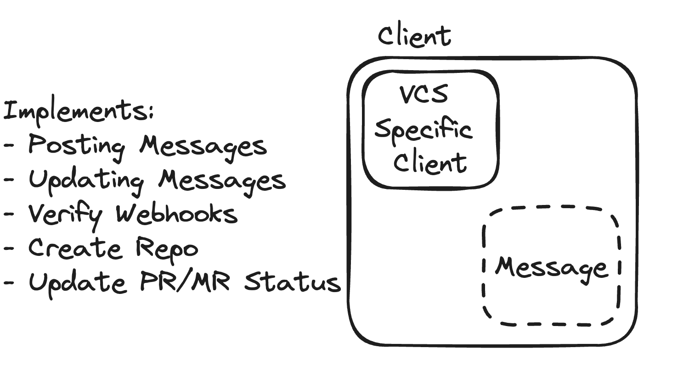

# Architecture

`kubechecks` is driven by webhook events from remote VCS providers (Github, Gitlab, etc), describing new commits/sets of changes (in the form of Pull/Merge Requests). These events are parsed by VCS specific `Client`s and cloned to a local `Repo`, which has all
the checks `kubechecks` runs made against it.

## Overview

Once `kubechecks` starts, it will listen on the configured webhook address for payload events. A specific [`Client` construct](#client) locally will parse all events on this address, dependent on which VCS provider you have configured `kubechecks` to
use (via the `KUBECHECKS_VCS_TYPE` environment variable, i.e. Github or Gitlab).

This `Client` will validate any webhook secrets,
appropriate format, etc and, once validated, will produce a [`Repo` struct internally](#repo). This `Repo` clones the `HEAD` of the
PR/MR branch locally, using the authenticated `Client`s credentials.

With the `Repo` built, it's time to run some checks! `kubechecks` begins processing concurrently all checks against this local `Repo` through a `CheckEvent`, first by determining which (if any) applications or application sets have been modified by the PR/MR's changes,
then concurrently checking each affected app individually and compiling the report. As each affected app is processed, a comment
on the PR/MR is updated reflecting the latest outcomes, letting you see in real-time what's happening.

## Components

`kubechecks` at it's core is built upon three core ideas; a `Client`, representing the remote VCS provider (i.e. Github or Gitlab) which parses webhook events and interacts with remote Pull/Merge requests; a `CheckEvent`, representing a single run of `kubechecks` in it's entirety; and a `Repo`, representing a local git repository with the changes contained within the webhook event.

### Client

{: style="height:350px;display:block;margin:0 auto;"}

### Repo

{: style="height:350px;display:block;margin:0 auto;"}\

### CheckEvent

{: style="height:350px;display:block;margin:0 auto;"}
